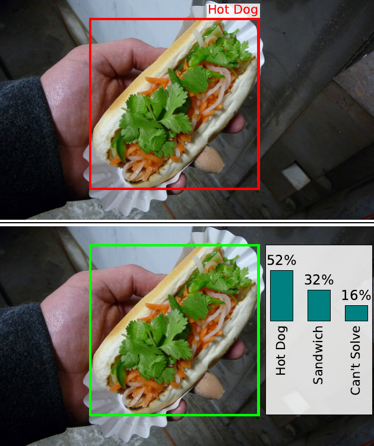

# Object Detection Benchmarks are Incomplete: The Role of Label Errors and Annotation Uncertainty

A comprehensive benchmark for **uncertainty-aware object detection** and **label error detection** in object detection datasets. This repository builds on crowd-sourced soft-label annotations for four common object detection datasets. It conducts post-processing such as annotator bias correction, benchmarks object detectors for the task of uncertainty-aware object detection and evaluates existing automated label error detection methods on a comprehensive collection of real label errors found through re-annotation.

<p align="center">
  <a href="https://arxiv.org/pdf/2609.21822v1"></a>
  <a href="https://osvia.org/ObjectDetectionBenchmarksAreIncomplete/"></a>
  <a href="https://doi.org/10.7910/DVN/Q9N7G9"></a>
</p>

<p align="center">
  
</p>

<p align="center">
  <em>The original single-label annotation ("Hot Dog") vs. our refined soft-label annotation, which captures the genuine ambiguity between "Hot Dog", "Sandwich", and "Can't Solve".</em>
</p>

---

## Overview

This project addresses the problem of **annotation errors in object detection datasets** and introduces **uncertainty-aware evaluation in object detection**. The core workflow is:

1. **Soft Label Post-Processing** — Correct systematic annotator bias in crowd-sourced bounding box annotations using the CleverLabel algorithm and other methods.
2. **Alignment with Experts** — Here, we compare crowd-sourced soft labels against expert evaluations.
3. **Label Error Ground Truth (LEGT) Creation** — Compare original dataset annotations against crowd-validated ground truth (VGT) to identify and categorize label errors.
4. **Label Error Detection Benchmark** — Evaluate how well automated methods can detect these errors
5. **Regression Benchmark** — Evaluate object detection models on original vs. corrected labels as well as on soft labels directly.

Please see the individual ReadMe files within each folder for more detailed information.

### Datasets Covered

| Dataset | Classes | Splits Used |
|---------|---------|-------------|
| **Cityscapes** | 9 (person, rider, car, truck, bus, train, motorcycle, bicycle, cantsolve) | train, val |
| **KITTI** | 8 (car, van, truck, pedestrian, person_sitting, cyclist, tram, cantsolve) | train, val |
| **PascalVOC 2012** | 21 (20 VOC classes + cantsolve) | train, val |
| **COCO 2017** | 81 (80 COCO classes + cantsolve) | val |
---

You can access the data at the Harvard Dataverse under  https://doi.org/10.7910/DVN/Q9N7G9. 
The refined Annotations for Cityscapes are available within the Cityscapes platform.

## Key Concepts

### Soft Labels vs Hard Labels

- **Soft labels**: Probability distributions over classes for each bounding box, derived from multiple annotator votes (e.g., `{"car": 0.7, "van": 0.2, "truck": 0.1}`)
- **Hard labels**: Single class assignment per bounding box, derived from soft labels using a probability threshold (typically 0.5)

### Label Error Types

The benchmark identifies four categories of label errors:

| Error Type | Description |
|------------|-------------|
| **Missing** | Object exists in VGT but not in original GT (false negative in original dataset) |
| **Misaligned** | Object exists in both but bounding box IoU is below threshold |
| **Classification** | Object exists in both with good IoU but wrong class label |
| **Original-only** | Object exists in original GT but not in VGT (spurious annotation) |

### CleverLabel Algorithm

A post-processing method that corrects systematic annotator bias by:
1. Estimating a **transition matrix** capturing class confusion patterns
2. Applying **bias correction** to shift probability mass away from over-represented classes
3. Using **class blending** with tunable parameters (delta, mu, overcorrection_threshold)

### Validated Ground Truth (VGT)

Ground truth annotations created by crowd-sourcing: multiple annotators independently label bounding boxes, and their votes are aggregated into soft labels. After post-processing, these are converted to hard labels using a probability threshold.

---

## Repository Structure

```
benchmark_paper_post_processing/
├── README.md                          # This file
├── configs/                           # Tuned post-processing parameters (per dataset)
├── dataset_tools/                     # Dataset format conversion notebooks
├── labelerrordetection/               # Model predictions evaluated against LEGT
├── labelerrordetectionbenchmark/      # PR curve benchmarking of detection methods
├── labelerrors/                        # Label error ground truth creation & analysis
├── our_datasets/                      # Soft-label annotation datasets (JSON)
├── outputs/                           # Generated results (plots, stats, configs)
├── postprocess/                       # Soft label post-processing module (CleverLabel)
├── regression_benchmark/              # Object detection model training & evaluation
└── softlabel_vs_humanperception/      # Human perception study
```

| Directory | Purpose | Has Own README |
|-----------|---------|:-:|
| [`postprocess/`](postprocess/) | Core post-processing algorithms (CleverLabel, downweight, resample, MLP) | ✅ |
| [`labelerrors/`](labelerrors/) | Create & analyze label error ground truth | ✅ |
| [`regression_benchmark/`](regression_benchmark/) | Train/evaluate 6 object detection models | ✅ |
| [`softlabel_vs_humanperception/`](softlabel_vs_humanperception/) | Human annotation study (3 reviewers) | ✅ |
| [`labelerrordetection/`](labelerrordetection/) | Evaluate model predictions vs. label errors | ✅ |
| [`labelerrordetectionbenchmark/`](labelerrordetectionbenchmark/) | Precision-recall benchmark of detection methods | ✅ |
| [`dataset_tools/`](dataset_tools/) | Format conversion utilities | ✅ |
| [`our_datasets/`](our_datasets/) | Annotation data files | ✅ |
| [`configs/`](configs/) | Post-processing configuration JSONs | ✅ |

---

## Pipeline Overview

The full pipeline proceeds in the following order. Each step depends on the outputs of the previous steps.

### Step 1: Post-Processing Soft Labels

```bash
# Tune parameters for all datasets (generates configs/*.json)
python -m postprocess.run_tuning_all

# Apply tuned post-processing to soft label files
python -m postprocess.run_apply --config cityscapes --input soft_Cityscapes_train
```

**Input:** Raw soft-label JSON files (`our_datasets/soft_*.json`)
**Output:** Post-processed soft labels, configs, statistics, histograms

### Step 2: Create Hard Labels & Validated Ground Truth

```bash
# Convert soft labels to hard labels (VGT) with probability threshold 0.5
python labelerrors/1_filter_hard_labels.py

# Save all annotated bboxes (including low-confidence) for analysis
python labelerrors/1_1_save_all_annotated_bboxes.py
```

**Input:** Post-processed soft label JSONs
**Output:** Per-image JSON files with hard-label bounding boxes in COCO format

### Step 3: Create Label Error Ground Truth

```bash
# Create LEGT per dataset (comparing original GT vs VGT)
python labelerrors/2_create_label_error_ground_truth_cityscapes.py
python labelerrors/2_create_label_error_ground_truth_coco.py
python labelerrors/2_create_label_error_ground_truth_kitti.py
python labelerrors/2_create_label_error_ground_truth_pascalvoc.py

# Validate and clean bounding box formats
python labelerrors/2_2_delete_label_errors_with_wrong_bbox_format.py

# Create filtered variants (by probability and height thresholds)
python labelerrors/2_3_create_label_error_ground_truth_variants.py
```

**Output:** Per-image LEGT JSON files categorizing each error by type

### Step 4: Count & Analyze Label Errors

```bash
# Count errors under different configurations → CSV + LaTeX tables
python labelerrors/3_count_label_errors_different_configurations_cityscapes.py
# ... (same for coco, kitti, pascalvoc)

# Statistical estimation of original-only error rates
python labelerrors/3_1_original_only_estimation.py
python labelerrors/3_2_original_only_distribution_plot.py
```

### Step 5: Label Error Detection Benchmark

Run inference with detection models (Cascade R-CNN, Grounding DINO), then evaluate precision-recall of label error detection methods.

### Step 6: Regression Benchmark

Train object detection models on original vs. corrected labels and compare performance.

### Step 7: Calibration & Human Perception

```bash
# Calibration scatter plots
python -m postprocess.run_calibration --dataset cityscapes
```

---

## Setup & Prerequisites

### Python Dependencies

Key packages required (install via pip):
- `numpy`, `pandas`, `scipy`
- `matplotlib`, `seaborn`
- `Pillow` (PIL), `opencv-python`
- `pycocotools`
- `torch`, `torchvision` (for MLP-based methods and regression benchmark)
- `ultralytics` (for YOLOv8/RT-DETR training)
- `getch` (for human perception annotation tool)

### Dataset Paths

Many scripts reference external dataset directories. Before running, update the path variables at the top of each script. Common paths to configure:

| Variable Pattern | Description |
|-----------------|-------------|
| `softlabel_json_path` | Soft-label JSON files (typically `our_datasets/`) |
| `gt_json_path` / `GT` | Original dataset ground truth in COCO format |
| `save_json_path` / `VGT` | Output directory for validated ground truth |
| `LEGT` | Output directory for label error ground truth |
| `IMAGE_DIR` | Raw dataset images for visualization |

All paths currently use placeholder values (`/path/to/...`) that need to be set to your local dataset locations.

---

## Configuration Files

The `configs/` directory contains tuned post-processing parameters generated by `postprocess/run_tuning_all.py`:

- `configs/cityscapes.json` — CleverLabel with delta=0.1, mu=1.0
- `configs/kitti.json` — CleverLabel with delta=0.0, mu=1.0
- `configs/pascalvoc.json` — Downweight with factor=0.5
- `configs/coco.json` — Multi-config with per-super-category parameters

See [`configs/README.md`](configs/README.md) for parameter details.

---

## Outputs

Generated results are stored in `outputs/`:

```
outputs/
├── application/       # Post-processed soft label stats + histograms (per dataset)
├── calibration/       # Calibration scatter plots (per dataset)
├── experiments/       # Per-dataset experiment plots (bias histograms)
└── paper/             # Publication-ready figures
```

---

## Quick Reference: Script Naming Convention

Scripts in `labelerrors/` follow a numbered convention indicating execution order:

| Prefix | Phase |
|--------|-------|
| `1_*` | Convert soft labels → hard labels (VGT creation) |
| `2_*` | Create label error ground truth (LEGT) |
| `3_*` | Count and analyze label errors |
| `4_*` | Additional analysis (difficult labels) |
| `plot_*` | Generate paper figures |
| `helpers_*` | Shared utility modules |
| `filter_*` / `number_*` | Auxiliary analysis scripts |

---

## License

License for Dataset Annotations
===============================

Copyright (c) 2026 Sarina Penquitt, Jonathan Klees, Antonia van Betteray,
Parssa Jashnieh, Peter Stehr, Matthias Rottmann, Lars Schmarje

The annotations created as part of our annotation pipeline are licensed
under the Creative Commons Attribution-ShareAlike 4.0 International License
(CC BY-SA 4.0).

To view a copy of this license, visit:
https://creativecommons.org/licenses/by-sa/4.0/

This license applies to the annotations created as part of our annotation
pipeline. The underlying images and original dataset content are not covered
by this license and remain subject to the respective licenses and terms of
the original datasets.

---

## Citation

If you use this benchmark or the accompanying annotation data in your research, please cite:

```bibtex
@inproceedings{penquitt2026object,
  title     = {{Object Detection Benchmarks are Incomplete: The Role of Label Errors and Annotation Uncertainty}},
  author    = {Penquitt, Sarina and Klees, Jonathan and van Betteray, Antonia and Jashnieh, Parssa and Stehr, Peter and Rottmann, Matthias and Schmarje, Lars},
  booktitle = {Advances in Neural Information Processing Systems Evaluations \& Datasets Track},
  year      = {2026},
}
```
